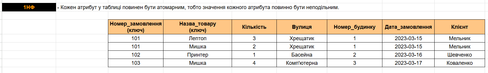
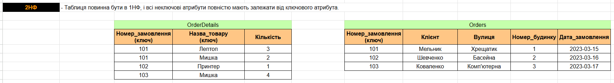
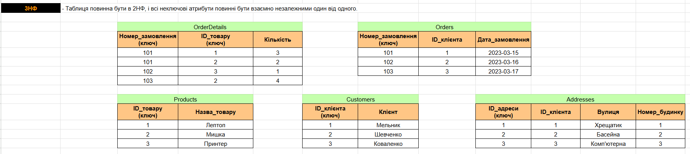
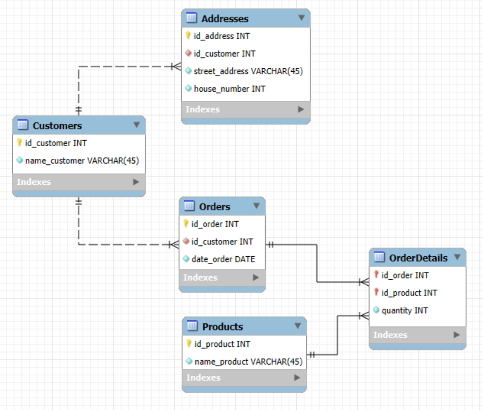

# goit-rdb-hw-02

[Link to the tables in the Google Sheets](https://docs.google.com/spreadsheets/d/1KJ5j5fovxFb2joU-42HkUyt2QKY9ZcHknWs7ba5SufI/edit?gid=0#gid=0)

- [Initial table](./initial_table.png)

  

- [1NF](./p1_1NF.png)

  

- [2NF](./p2_2NF.png)

  

- [3NF](./p3_3NF.png)

  

  [Link to the EER Diagram](./goit-rdb-hw-02_EER_Diagram.mwb)

- [EER Diagram](./p4_EER_Diagram.png)

  

- [Schemas](./p5_schemas.png)

  
